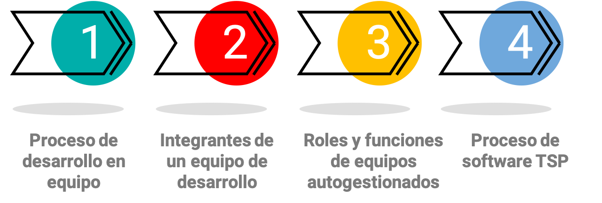
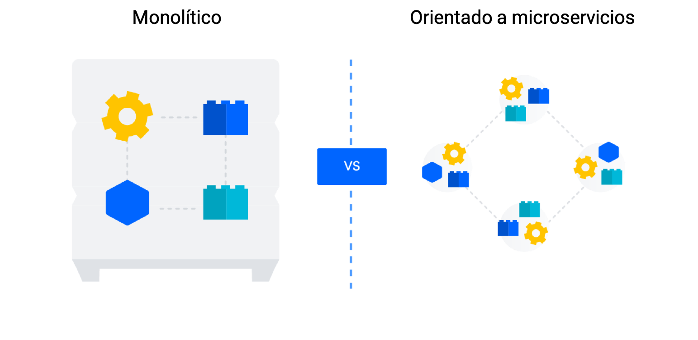
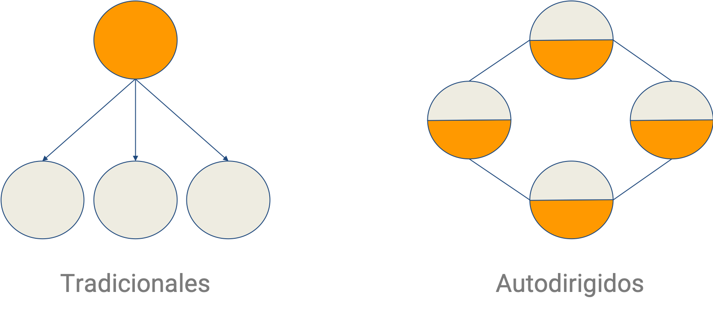

# Unidad 1: Desarrollo en Equipo

## Contenido de la unidad




## Proceso de desarrollo de software en equipo

### Aspectos generales del desarrollo de software


---

### Actores fundamentales en el desarrollo de software
---

::::{grid}
:gutter: 3

:::{grid-item-card} 
:class-body: text-center
:class-header: bg-light text-center
Administración del proyecto
^^^
```{image} _static/images/admin_proyect.png
:height: 100
:class: rounded
```


:::

:::{grid-item-card} 
:class-body: text-center
:class-header: bg-light text-center
Buenas prácticas
^^^
```{image} _static/images/buenas_practicas.png
:height: 100
:class: rounded
```

:::
:::{grid-item-card} 
:class-body: text-center
:class-header: bg-light text-center
Implementación de software
^^^
```{image} _static/images/implementacion_sfw.png
:height: 100
:class: rounded
```
:::
::::

---

### Prácticas en la administración de un proyecto
**Organizar** y **guiar** el trabajo del equipo de desarrollo y **vigilar** el cumplimiento de los requisitos (funcionales y no funcionales), restricciones de los stakeholders, entre otras cosas.

  


* Comunicación directa y permanente con el cliente
* Armar el plan de trabajo y cronograma de actividades
* Vigilar el cumplimiento de los requisitos
* Conocer las restricciones de los stakeholders
* Inversión
* Tiempos de entrega
* Infraestructura
* Servicio de soporte del desarrollo final

---

### Prácticas en la implementación


#### Etapas generales en el desarrollo de software

- Requisitos
- Diseño
- Implementación
- Pruebas
- Despliegue
- Otras

---

### El desarrollo de software en la actualidad




```{tip}
[Comparación entre la arquitectura monolítica y la arquitectura de microservicios (atlassian.com)](https://www.atlassian.com/es/microservices/microservices-architecture/microservices-vs-monolith#:~:text=Una%20aplicaci%C3%B3n%20monol%C3%ADtica%20se%20compila,pueden%20implementar%20de%20forma%20independiente)
```

---

### Importancia de equipos en el desarrollo de software

::::{grid}
:gutter: 3

:::{grid-item-card}
:class-body: text-right
:class-header: bg-light text-center
```{dropdown} Pros
* Diferentes puntos de vista
* Diferentes capacidades y talentos
* Soluciones a la complejidad
* Productos de alta calidad
```
:::

:::{grid-item-card}
:class-body: text-right
:class-header: bg-light text-center
```{dropdown} Aspectos a afrontar
* Grupos de personas puede ir en direcciones diferentes si no hay una guía clara.
* Sincronizar el equipo requiere tiempo de trabajo conjunto y varios proyectos.
* Cada integrante del equipo puede tener una idea diferente de como solucionar un mismo problema.
```
:::

::::

---

### Equipos tradicionales Vs Equipos autodirigidos

