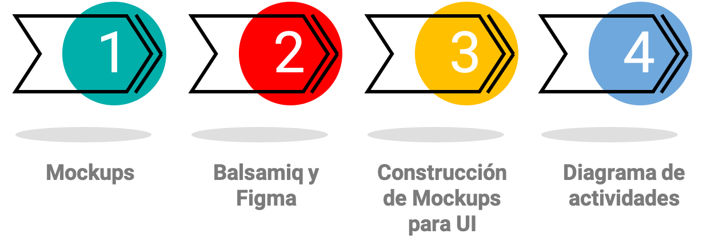
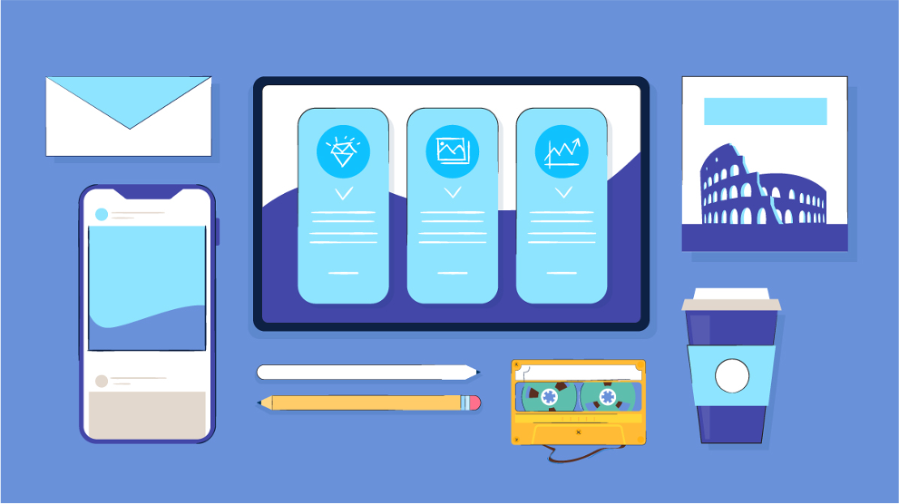
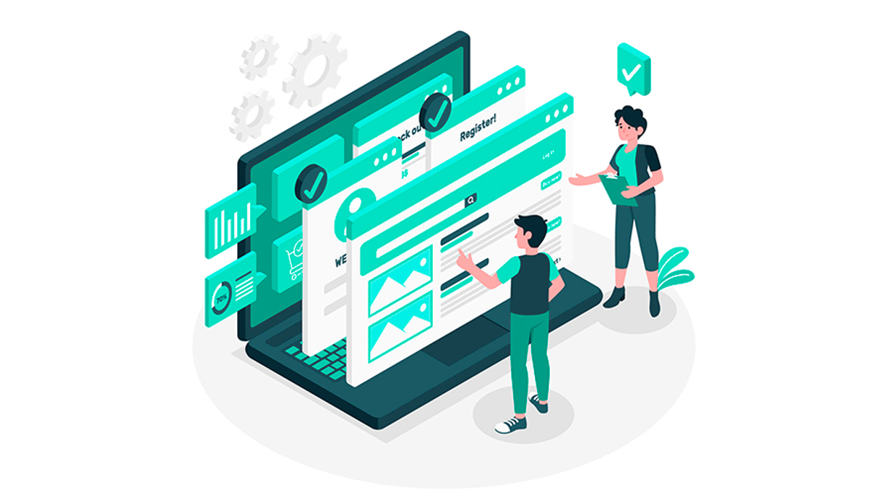
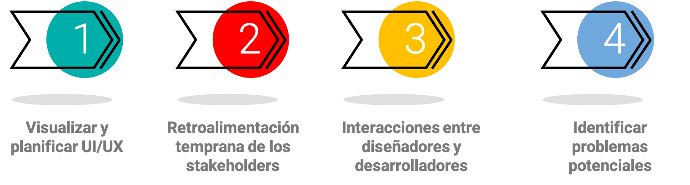
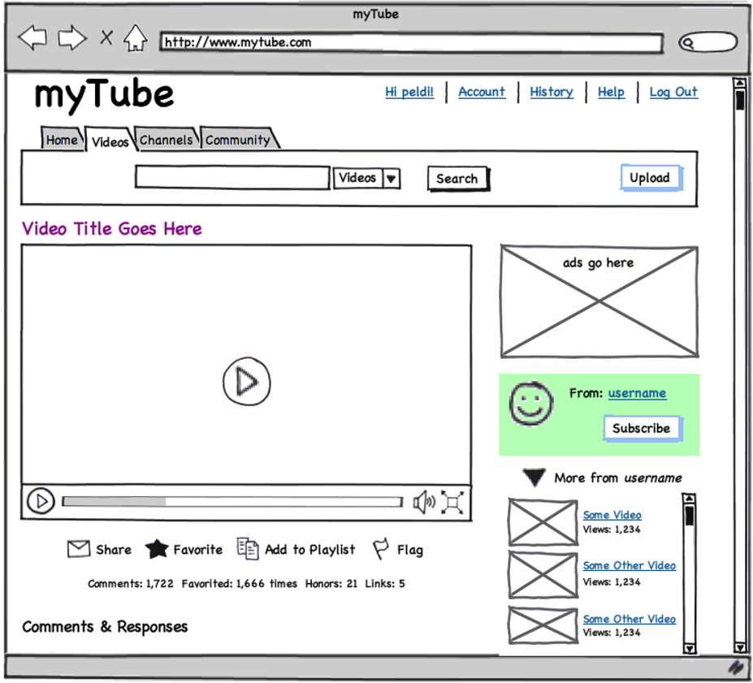
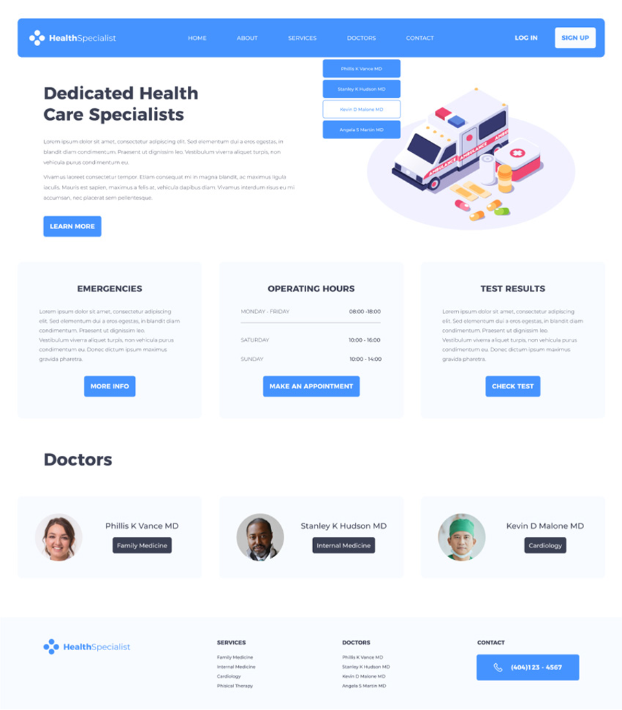
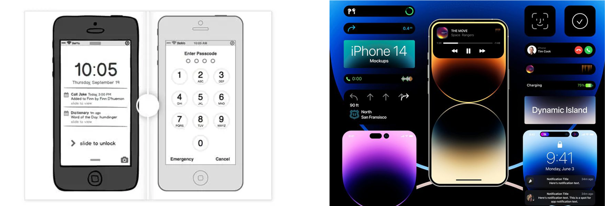
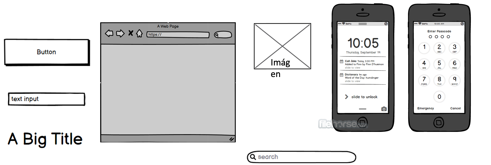
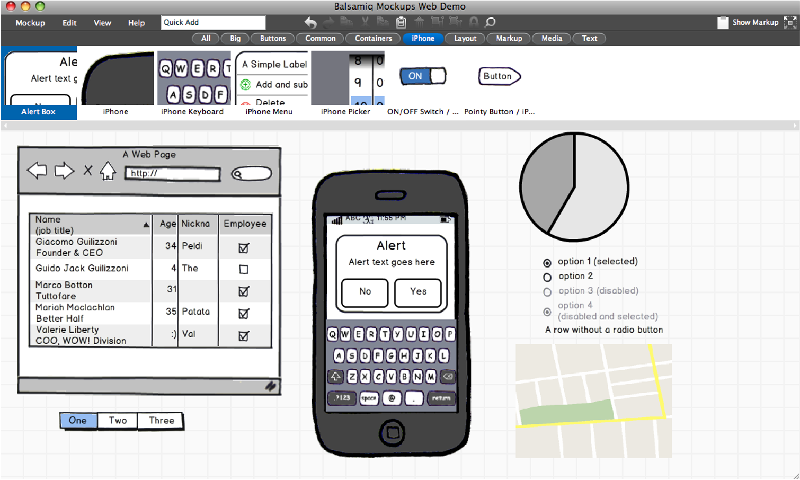

# Unidad 8: Mockup's y UI's

## Contenido de la unidad

## ¿Qué son los mockups?

* Es la representación visual de un **Prototipo** del proyecto que se va a realizar.

* Una serie de imágenes que nos mostrarán el resultado que tendrá la maqueta web.

---

## ¿Qué son los UI's?

* Un **mockup** es una interfaz de usuario.
* Es la representación visual de la interfaz de usuario.
* Es la parte del diseño que se encarga de la interacción del usuario con el sistema.
* El diseño de la interfaz de usuario debe garantizar que la interacción entre el ser humano y la máquina, se realice de manera satisfactoria.

---

## Utilidad de los mockups y UI's en el proceso de software

1. Ayudan a visualizar y planificar la interfaz de usuario (UI) y la experiencia de usuario (UX) de la aplicación o sitio web antes de comenzar a programar. Esto permite a los diseñadores y desarrolladores tener una comprensión clara de cómo se verá y funcionará la aplicación antes de invertir tiempo y recursos en la programación.

2. Permiten obtener retroalimentación temprana de los usuarios, clientes y stakeholders sobre la funcionalidad y el diseño de la aplicación. Los mockups son más fáciles de crear y modificar que el código real, lo que significa que los diseñadores pueden experimentar con diferentes opciones y recibir comentarios rápidos sobre lo que funciona y lo que no.

3. Facilitan la comunicación entre los diseñadores y desarrolladores, ya que los mockups proporcionan una base visual para que los equipos discutan los detalles de la UI y la UX. Esto puede reducir el tiempo que se tarda en completar una tarea y disminuir la posibilidad de malentendidos o errores en la implementación.

4. Pueden ayudar a identificar problemas potenciales en la funcionalidad o el diseño de la aplicación antes de la implementación. Si se descubre un problema en un mockup, es más fácil y económico corregirlo en esta etapa que después de que se ha escrito el código.

---

## ¿Cómo se ve un Mockup?

Este tipo de representaciones visuales pueden ser muy variadas, desde un simple boceto en papel hasta un prototipo interactivo.

---

## Herramientas para crear Mockups

* [Balsamiq](https://balsamiq.com/)
* [Mockflow](https://www.mockflow.com/)
* [Mockplus](https://www.mockplus.com/)
* [Moqups](https://moqups.com/)
* [Wireframe.cc](https://wireframe.cc/)
* [Figma](https://www.figma.com/)
* [Adobe XD](https://www.adobe.com/products/xd.html)
* [Sketch](https://www.sketch.com/)
* [Invision](https://www.invisionapp.com/)
* [Marvel](https://marvelapp.com/)
* [Framer](https://www.framer.com/)
* [Axure](https://www.axure.com/)
* [UXPin](https://www.uxpin.com/)
* [Proto.io](https://proto.io/)
* [Fluid UI](https://www.fluidui.com/)
* [Justinmind](https://www.justinmind.com/)
* [Origami Studio](https://origami.design/)
* [Principle](https://principleformac.com/) 
  

---

## Proceso de creación de un Mockup

* **Identificar** los elementos que deben incluirse en esta representación visual.

*  **Implementar** el mockup.
  

* **Verificar** que el mockup cumpla con los requerimientos y esté alineado a los casos de uso.

## Veamos como funciona Balsamiq

## 🌐 Enlaces extra

**Recursos educativos de mockups**

* [Aprende a utilizar balsamiq Mockups paso a paso con ejemplos - YouTube](https://www.youtube.com/watch?v=6vXjEd6BWgo&ab_channel=LuisAngelVelasco)
* [Minicurso de Balsamiq Mockups (1) - Los wireframes y la interfaz - YouTube](https://www.youtube.com/watch?v=4WqfxF1QjTM&ab_channel=EDteam)
* [Minicurso de Balsamiq Mockups (2) - La libreria de elementos - YouTube](https://www.youtube.com/watch?v=mmjLcW68w24&ab_channel=EDteam)
* [Minicurso de Balsamiq Mockups (3) - Assets y simbolos - YouTube](https://www.youtube.com/watch?v=oMMwi7F1YoM&ab_channel=EDteam)
* [Minicurso de Balsamiq Mockups (4, final) - Presentar el proyecto - YouTube](https://www.youtube.com/watch?v=ek3dtaN9iyI&ab_channel=EDteam)

**Figma**
[Figma Tutorial - Como utilizar Mockups - YouTube](https://www.youtube.com/watch?v=1MK8l_X8FJ0&ab_channel=TemplunebyDiegoVel%C3%A1zquez)