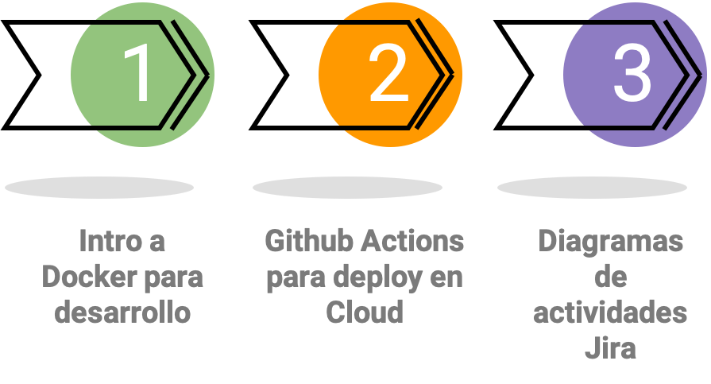

# Unidad 9: Herramientas para desarrollo y gestión de proyectos de software

## Contenido de la unidad



## Vamos a clonar el repositorio y verificar que todo funcione.

1. Vamos a realizar un fork del repositorio de la aplicación de backend. [Backend](https://github.com/johanpina/auth_service_class)
2. Clonemos el repositorio y revisemos que todo funcione correctamente.

```bash
git clone https://github.com/johanpina/auth_service_class.git
cd auth_service_class

```

3. Vamos a instalar las dependencias de la aplicación.

```bash
python -m venv .venv
source .venv/bin/activate // .venv/Scripts/activate

pip install -r requirements.txt

```

4. Vamos a ejecutar la aplicación.

```bash
uvicorn main:app --reload
```

5. Vamos a probar la aplicación en el navegador. (login, signup, verificar datos en DB)

## Despleguemos esto en la nube.

::::{card-carousel} 1

:::{card}
:margin: 3
:class-body: text-center
:class-header: bg-light text-center
:link: https://render.com/

**💬 Cuenta en render**
^^^
```{image} https://media.licdn.com/dms/image/D4E0BAQGGDoFoqHtOvA/company-logo_200_200/0/1702595267620/renderco_logo?e=2147483647&v=beta&t=Ywm0UZpTXbiXPopyfCDty8QXSEVz88QWWCwy28qLUyE
:height: 100
```
Vamos a crear una cuenta en Render con el correo de github.
+++
Explore this link {fas}`arrow-right`
:::
::::


### Crear la aplicación en Render

1. Vamos a crear una nueva aplicación en Render.
2. Vamos a seleccionar la opción de **Web Service**.
3. Vamos a seleccionar el repositorio de la aplicación de backend.
4. Vamos a seleccionar la rama de **main**.
5. Se debe seleccionar el runtime de Python.
6. Se debe configurar la ruta de la aplicación.
7. Se debe configurar el comando para ejecutar la aplicación: uvicorn main:app --host=0.0.0.0 --port=8000
8. Se debe configurar el puerto de la aplicación. PORT 8000
9. Vamos a crear la aplicación.

## Introducción a Docker

Docker es una plataforma de código abierto que permite a los desarrolladores y a los administradores de sistemas construir, enviar y ejecutar aplicaciones en contenedores. Estos contenedores son unidades estándar de software que empaquetan el código y todas sus dependencias para que la aplicación se ejecute de manera rápida y confiable desde un entorno a otro.


## ¿Qué es la vitualización?


La virtualización se refiere a la creación de versiones virtuales de recursos físicos, como servidores, dispositivos de almacenamiento, redes e incluso sistemas operativos. En lugar de interactuar con el hardware físico directamente, los sistemas y aplicaciones interactúan con representaciones virtuales de ese hardware. Esta abstracción permite una mayor flexibilidad, eficiencia y consolidación de recursos.

### Deventajas de las máquinas virtuales

* **Peso**: El el orden de los GB. Repiten archivos en común. Inicio lento.
* **Costo de la administración**: Necesita mantenimiento igual que otra computadora.

* **Múltiples formatos**: VDI, VMDK, VHD, raw, etc.

## ¿Qué es un contenedor?

Un contenedor es una unidad estándar de software que empaqueta el código y todas sus dependencias para que la aplicación se ejecute de manera rápida y confiable desde un entorno de desarrollo a un entorno de producción.


### Ventajas de los contenedores

* **Flexibles:** No importa el tipo de aplicación que decidas meter en un contenedor, siempre funcionará igual.
* **Ligeros:** Los contenedores comparten el mismo kernel del sistema operativo y solo ejecutan los procesos que necesitan, por lo que son mucho más ligeros que las máquinas virtuales.
* **Portables:** Puedes construir localmente, desplegar en la nube y ejecutar en cualquier lugar.
* **Escalables:** Puedes aumentar y distribuir automáticamente réplicas de contenedores en función de la demanda.
* **Seguros:** Los contenedores aplican aislamiento de recursos y restricciones de acceso, al tiempo que aprovechan el kernel del host subyacente.
* **Bajo acoplamiento:** Los contenedores están altamente acoplados con el código y las dependencias que contienen, pero están débilmente acoplados con otros contenedores y la infraestructura subyacente.


## Contenedores vs máquinas virtuales(VM's)

A diferencia de las máquinas virtuales, que virtualizan todo el sistema operativo y el hardware subyacente, los contenedores virtualizan el sistema operativo, compartiendo el mismo núcleo del sistema operativo, pero funcionando en espacios de usuario separados.


## Docker

Docker es una de las plataformas de contenedores más populares y ha jugado un papel fundamental en la popularización de la tecnología de contenedores.


### Instalación de Docker

::::{card-carousel} 1

:::{card}
:margin: 3
:class-body: text-center
:class-header: bg-light text-center
:link: https://www.docker.com/get-started/

**💬 Descargar Docker**
^^^
```{image} https://seeklogo.com/images/D/docker-logo-6D6F987702-seeklogo.com.png
:height: 100
```
Vamos a descargar Docker Desktop para Windows o Mac.
Crear una cuenta en docker-hub también.
+++
Explore this link {fas}`arrow-right`
:::
::::


### Comandos básicos de Docker

* **docker version**: Muestra la versión de docker.
* **docker info**: Muestra información del sistema.
* **docker build**: Construye una imagen.
* **docker run**: Ejecuta un contenedor.
* **docker inspect**: Muestra información detallada de un contenedor.
* **docker prune**: Elimina contenedores, imágenes, volúmenes y redes no utilizados.
* **docker ps**: Lista los contenedores que se están ejecutando.
* **docker ps -a**: Lista todos los contenedores.
* **docker stop**: Detiene un contenedor.
* **docker rm**: Elimina un contenedor.

## Vamos a creaer el contenedor de la aplicación de backend.


### Asegurate de tener instalado Git.

::::{card-carousel} 1

:::{card}
:margin: 3
:class-body: text-center
:class-header: bg-light text-center
:link: https://git-scm.com/downloads

**💬 Instalar Git**
^^^
```{image} https://git-scm.com/images/logo@2x.png
:height: 100
```
Install git
+++
Explore this link {fas}`arrow-right`
:::
::::

### Crear el archivo Dockerfile

```dockerfile

# Usa una imagen base de Python
FROM python:3.10-slim-buster

# Copia los archivos de tu proyecto al contenedor
COPY . /app

# Cambia al directorio de la aplicación
WORKDIR /app

# Instala las dependencias
RUN pip install --no-cache-dir -r requirements.txt

# Expone el puerto que utilizará FastAPI
EXPOSE 8000

# Comando para ejecutar la aplicación
CMD ["uvicorn", "main:app", "--host", "0.0.0.0", "--port", "8000"]

```


### Crear el archivo .dockerignore

```.dockerignore
__pycache__/
.dockerignore
Dockerfile
*.pyc
*.pyo
*.pyd
.Python
db.sqlite3
*.git
*.so
*.DS_Store
```

### Construir la imagen del contenedor

```bash
docker build -t backend .
```

### Ejecutar el contenedor

```bash
docker run -d --name backend -p <local_PORT>:<container_PORT> backend
```

```bash
docker run -d --name backend -p 8000:8000 backend
```

### Verificar que el contenedor se está ejecutando

```bash
docker ps
```

### Vamos a subir a github el cambio de los archivos Dockerfile y .dockerignore

```bash
git add .
git commit -am "Dockerfile and .dockerignore added"
git push
```

**Ahora vamos a realizar el despliegue de nuestra aplicación apoyados del contenedor en un servidor.**


::::{card-carousel} 1

:::{card}
:margin: 3
:class-body: text-center
:class-header: bg-light text-center
:link: https://render.com/

**💬 Cuenta en render**
^^^
```{image} https://media.licdn.com/dms/image/D4E0BAQGGDoFoqHtOvA/company-logo_200_200/0/1702595267620/renderco_logo?e=2147483647&v=beta&t=Ywm0UZpTXbiXPopyfCDty8QXSEVz88QWWCwy28qLUyE
:height: 100
```
Vamos a crear una cuenta en Render con el correo de github.
+++
Explore this link {fas}`arrow-right`
:::
::::


### Crear la aplicación en Render a partir de docker


1. Vamos a crear una nueva aplicación en Render.
2. Vamos a seleccionar la opción de **Web Service**.
3. Vamos a seleccionar el repositorio de la aplicación de backend.
4. Vamos a seleccionar la rama de **main**.
5. Se debe seleccionar el runtime de docker.
6. Se debe configurar la ruta del dockerfile.
7. Se debe configurar el puerto de la aplicación. PORT 8000
8. Vamos a crear la aplicación.