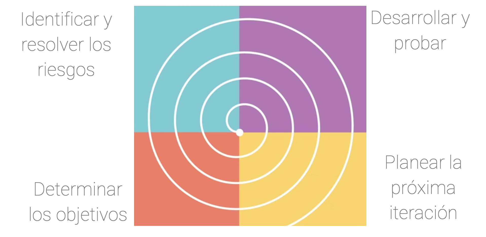
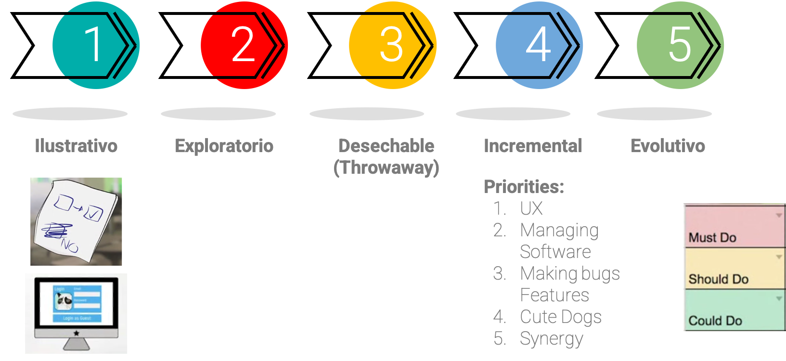

## Tipos de procesos de software


Algunos de los tipos de procesos de software son:

* Modelos lineales
* Modelos en espiral
* El proceso unificado
* Creación de prototipos
* Entrega continua

Cada uno de estos se implementa dependiendo de: el tipo de desarrollo que realicemos, las necesidades, tiempos y stakeholders con los que se cuente.

---

### 🛣️ Modelos lineales

**En este modelo la fase siguiente no puede empezar sin que termine la fase anterior.**

El cliente final no está involucrado **Completamente** en el proceso de software (No hay retroalimentación).

Estos procesos pueden consumir muchos recursos cuando **NO** se planea adecuadamente.

Dentro de los modelos lineales tenemos:

::::{dropdown} Cascada (Waterfall)

```{image} ../../_static/images/U3_14.png
```

* Solo se involucra al cliente en dos momentos: En el arranque del proyecto y en la última etapa de verificación (cuando el sistema está completamente desplegado).

* **No permite ejecutar fases en paralelo.**

::::


::::{dropdown} V-Model

```{image} ../../_static/images/U3_15.png
```

* Es una mejora al modelo de cascada.
* Tiene un proceso más riguroso de calidad, basado en los documentos y fases iniciales del proyecto (requerimientos, diseños)
* El cliente solo ve el resultado final del desarrollo en la última etapa.
* Se debe tener una gran cantidad de información inicial y un buen proceso de requerimientos para entender la idea del cliente. ya que, el cliente valida y retroalimenta el proceso hasta el final del proyecto.
::::

::::{dropdown} Modelo Diente de sierra

```{image} ../../_static/images/U3_16.png
```

* Involucra de forma más activa al cliente en el desarrollo del proyecto.
* No deja de ser un modelo lineal, pero cuenta con verificación por parte del cliente en cada una de las fases, lo que permite corregir errores y evidenciar avances durante el proyecto

::::

---

### 🌀 Modelos en espiral

Es un proceso iterativo, que realiza cada etapa por fases de **4** pasos.
Se enfoca en la calidad del proceso. y se analizan lo posibles riesgos de esa fase antes de la implementación.


Este proceso divide la espiral en 4 sectores. Cada cuadrante contiene un tipo de proceso iterativo diferente...

EL proceso en **Espiral** permite retroalimentación constante por parte del cliente.

```{warning}
 Se da la posibilidad de regresar a las etapas anteriores, lo que implica un tiempo de desarrollo más largo e indefinido.
```


#### Fases del modelo en espiral



::::{grid} 1 1 2 2
:class-container: text-center
:gutter: 3

:::{grid-item-card}
:class-header: bg-light

**Fase 1 🌀**
^^^

Determinar los objetivos, alternativas y restricciones del proyecto

*Es lo primero que se realiza.*
:::

:::{grid-item-card}
:class-header: bg-light

**Fase 2 🌀**
^^^

Identificar y resolver los riesgos en el proyecto

*Un grupo debe identificar y resolver los riesgos, normalmente estos deben ser grupos con gran experiencia. Se debe tener un prototipo antes de comenzar a desarrollar y probar.*
:::
:::{grid-item-card}
:class-header: bg-light

**Fase 3 🌀**
^^^

Desarrollar y probar.

*Se realiza el desarrollo y las pruebas que se determinen en los objetivos.*


:::
:::{grid-item-card}
:class-header: bg-light

**Fase 4 🌀**
^^^

Planear la próxima iteración

*Planear lo que se debe realizar en la próxima iteración*
:::

::::

#### ✅ Ventajas del modelo en espiral

* El análisis del riesgo se hace de forma explícita y clara.
* Une los mejores elementos de los anteriores modelos (Cascada & Modelo V).
* Reduce riesgos del proyecto.
* Incorpora objetivos de calidad.


Permite hacer ajustes en el plan de trabajo, pero requiere consumo alto de recursos y tiempo, en parte porque los riesgos los debe realizar una persona con mucha experiencia.

---

### 🚀 El proceso unificado


En este se trabaja en fases básicas que tienen unas cuantas iteraciones, estas se repiten hasta que el producto final se entrega y se considera completa.

Este proceso NO **se centra** en cada uno de los requerimientos del documento de requerimientos sino en los **diagramas** y la **arquitectura**, lo que permite hacer las tareas en paralelo junto con otras. Es efectivo cuando se trabaja con arquitecturas orientada a microservicios.

**No** solo es un proceso iterativo sino que también es paralelo.

**Es  muy bueno para proyectos largos**


#### Etapas del proceso unificado


::::{dropdown} Fase de Inicio

```{image} ../../_static/images/U3_20.png
```

La única fase del proceso unificado en la que no se hace iteración es en la fase de inicio o inception

* Se define la arquitectura del sistema.
* Se elaboran los casos de uso del sistema
  
**Se definen los riesgos y el enfoque del proyecto**

Las siguintes fases si se desarrollan ciclicamente y cada etapa se realizan en paralelo (hasta cierto punto). Pero esta etapa **NO**

::::

::::{dropdown} Fase de Elaboración

```{image} ../../_static/images/U3_21.png
```

Es la primera fase que se hace cíclicamente, en esta se generan los diseños y diferentes tipos de  prototipos del desarrollo que se establecen en la fase anterior.

Se generan: 

* Diagramas de casos de uso
* Diagramas de clases
  
Para finalizar esta etapa, se entrega un plan para el desarrollo de la siguiente fase.

::::


::::{dropdown} Fase de Construcción

```{image} ../../_static/images/U3_22.png
```

**Es en esta etapa donde el proyecto cobra vida**

- En esta fase se aplica todo lo que se planea durante la primer etapa e integra todo lo que se aprende en la etapa de elaboración.

- Recordar que acá todo puede ocurrir en paralelo.

- La implementación ocurre iterativamente.

::::

::::{dropdown} Fase de Transición

```{image} ../../_static/images/U3_23.png
```

**Ya se encuentra terminada una versión madura para ser publicada con el usuario Final**

- El producto se encuentra en producción.
- El producto pasa de los desarrolladores al cliente finales mediante algunas iteraciones de pruebas y ajustes de errores.
- una vez se termina esta etapa se puede tomar la decisión de regresar a otra etapa si se requieren mayores cambios.

::::

### Creación de prototipos


Este se aplica a los modelos iterativos, enfocado principalmente en el de espiral y el de proceso unificado.

Los prototipos son importantes porque el cliente interviene en la validación de las diferentes etapas del proceso de desarrollo, así como el cumplimiento de los requerimientos.




::::{grid} 1 1 2 3
:class-container: text-center
:gutter: 3

:::{grid-item-card}
:class-header: bg-light

**Ilustrativo 📄**
^^^

Es el más básico, solo se entregan dapositivas o bosquejos en un papel. Se aplican para ilustrar una idea de manera rápida y sujeta a muchos cambios. Es poco fiable pero, plasmar la idea de lo que se quiere lograr con el cliente en un prototipo evita gastar más tiempo y/o recursos.
:::

:::{grid-item-card}
:class-header: bg-light

**Exploratorio 🔍**
^^^

En este se requiere un poco más de tiempo, se codifica un poco más,no solo se ve como será el sistema sino sus interacciones y posibles dificultades. Es como una prueba de concepto para un producto. Se recomienda buscar si ya hay algo desarrollado o que pueda servir en el proyecto.

:::
:::{grid-item-card}
:class-header: bg-light

**Desechable 🗑️**
^^^

El prototipo desechable es en el que se tiene una versión poco funcional, luego en la siguiente entrega se presenta algo más funcional usando la primera versión y se eimina la versión anterior y así sucesivamente hasta que se logra un prototipo que cumpla con los alcances finales del proyecto.
:::

:::{grid-item-card}
:class-header: bg-light

**Incremental 🪜**
^^^

En este se realizan por fases las entregas, cada entrega es un producto completamente funcional y se van priorizando en el orden que se ve en la imágen. Vamos de lo que se debe hacer (Must Do) hasta lo que se puede hacer(Could Do). El propósito es agregar nuevas características a lo largo del tiempo y de las entregas.

:::

:::{grid-item-card}
:class-header: bg-light

**Evolutivo 🏃🏽‍♂️🦍**
^^^

En este tipo de prototipos empezamos con todas las características en una forma base (versión funcional) y luego estas caracteristicas van evolucionando al mismo tiempo durante la implementación. En este se va de algo rústico a un producto más elaborado.

:::


::::

### ♻️ Entrega continua 


Permite sistematizar la forma en la que se integran los avances de un producto sin traumatismos, evitando reprocesos y tiempos de depliegue elevados.

Permite entregar continuamente avances del proyecto y que cada vez que se haga una funcionalidad nueva, se compile, integre, pruebe y se despliegue.

Se deben tener varias ramas en el proyecto. Normalmente una de **desarrollo**, una de **stage** que es la que se usa para pruebas y una de **producción** (main) que es la que se usa para el producto final.

