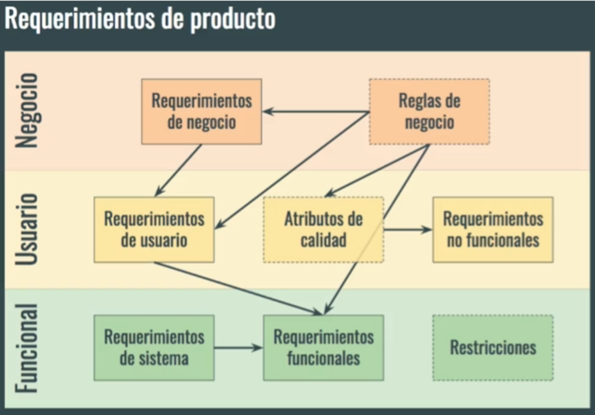

(Nivel_requisitos)=
## Niveles de requisitos



* **Negocio:** ¿Por qué se está implementando el sistema?. Objetivos generales de la organización o los clientes.
* **Usuario:** Lo que el usuario podrá hacer con la aplicación. Funciones del usuario en su trabajo.
* **Funcionales:** Lo que el desarrollador debe construir. Funciones detalladas del sistema.

---

### Ejemplos de niveles de requisitos:

**Requisito del negocio:** Aumentar en un 15 % la cantidad de estudiantes que participan en semilleros de investigación

**Requisito del usuario:** Los estudiantes podrán consultar semilleros de investigación por área

**Requisito del software:**

* El sistema validará que el área tenga semilleros activos (o muestra mensaje de error).
* El sistema consultará los semilleros activos del área, y de cada uno mostrará nombre y 100 caracteres de la descripción. Se mostrarán hasta 20 semilleros por página.

---

## Lo que NO es un requisito

* Detalles de diseño o de implementación (el “cómo”): Los requisitos deben centrarse en describir qué debe hacer el sistema y no en cómo se debe construir o implementar. Los detalles de diseño suelen ser responsabilidad de los equipos de desarrollo y se definen en etapas posteriores al establecimiento de los requisitos.
* Información sobre pruebas: Si bien es importante que los requisitos sean verificables, la información detallada sobre cómo se llevarán a cabo las pruebas no forma parte de los requisitos. Los casos de prueba y los escenarios de prueba se desarrollan después de establecer los requisitos.
  
* Información sobre planeación.
  * Presupuesto: Los requisitos no deben incluir información sobre el presupuesto del proyecto. La asignación de recursos financieros es una consideración de gestión de proyectos y no un requisito.
  * Tiempos del proyecto: Los plazos y la planificación del proyecto son responsabilidad de la gestión de proyectos y no deben confundirse con los requisitos.

**los requisitos se centran en lo que se necesita lograr, no en cómo se logrará ni en detalles de planificación, presupuesto o pruebas. Estos son aspectos que se manejan en fases posteriores del ciclo de desarrollo del software.**

---

```{note} 

_**Ejercicio para discusión rápida**_
Determine si es un requisito o no:

* El sistema deberá permitir el registro de nuevos usuarios.
* El sistema se desarrollará en Python.
* El sistema deberá mostrar los resultados de cada consulta en menos de 3 segundos.

```
